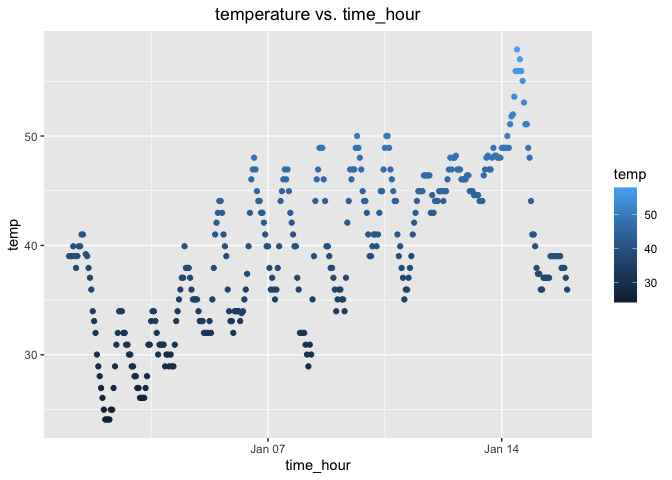

p8105_hw_cl4469
================

# Problem 1

###### Load the moderndive library, and use the following code to load the early_january_weather dataset:

``` r
library(moderndive)
data("early_january_weather")
```

###### The following code loads the early_january_weather dataset and includes a description

``` r
data_set <- data("early_january_weather")
```

###### Describing the Data Set

``` r
mean(early_january_weather$temp)
```

    ## [1] 39.58212

``` r
range(early_january_weather$temp)
```

    ## [1] 24.08 57.92

``` r
median(early_january_weather$temp)
```

    ## [1] 39.02

``` r
range(early_january_weather$humid)
```

    ## [1]  32.86 100.00

``` r
mean(early_january_weather$humid)
```

    ## [1] 65.4767

``` r
range(early_january_weather$wind_speed)
```

    ## [1]  0.00000 24.16638

This data set contains 358 observations of 15 variables, including:
origin, year, month, day, hour, temperature, dew, humidity, wind
direction, wind speed, wind gust,precipitation, pressure, visibility.

Values for temperature range from 24.08 to 57.92, the mean of
temperature is 39.5821, median is 39.02. Values for humidity range from
32.86 to 100, mean humidity is 65.4767. Values for wind speee range from
0 to 24.14.

###### Describe the size of the dataset (using nrow and ncol)

``` r
nrow(early_january_weather)
```

    ## [1] 358

``` r
ncol(early_january_weather)
```

    ## [1] 15

###### Describe the mean temperature

``` r
mean(early_january_weather$temp)
```

    ## [1] 39.58212

###### Make a scatterplot of temp (y) vs time_hour (x)

``` r
library(ggplot2)

ggplot(early_january_weather,aes(x=time_hour,y=temp, color=temp))+
  geom_point()+
  ggtitle("temperature vs. time_hour")+
  theme(plot.title = element_text(hjust = 0.5))
```

<!-- -->

``` r
ggsave("scatterplot_temp vs. time_hour.pdf")
```

    ## Saving 7 x 5 in image

###### Describe this plot:

Temperatures are changing all the time, and in general, early January is
showing an upward trend. However, we can also clearly see that the
temperature is falling and then rising on a daily basis, constantly
repeating itself. In addition, the day at the beginning of the month and
the day in the middle of the month the temperature drops significantly.

# Problem 2

``` r
library(dplyr)
```

    ## 
    ## Attaching package: 'dplyr'

    ## The following objects are masked from 'package:stats':
    ## 
    ##     filter, lag

    ## The following objects are masked from 'package:base':
    ## 
    ##     intersect, setdiff, setequal, union

###### Creat Sample data frame

``` r
problem_df= tibble(
  vec_numeric = rnorm(10),
  vec_logical = vec_numeric > 0,
  vec_char = c("one", "two", "three", "four", "five", "six", "seven", "eight",
  "nine", "ten"),
  vec_factor = factor(c(rep("low",3),rep("medium",3), rep("high",4)))
)
```

###### Now, I try to take the mean of each variable in my data frame

``` r
mean(problem_df)
```

    ## Warning in mean.default(problem_df): argument is not numeric or logical:
    ## returning NA

    ## [1] NA

``` r
mean(pull(problem_df, vec_numeric))
```

    ## [1] -0.3391789

``` r
mean(pull(problem_df, vec_logical))
```

    ## [1] 0.3

``` r
mean(pull(problem_df, vec_char))
```

    ## Warning in mean.default(pull(problem_df, vec_char)): argument is not numeric or
    ## logical: returning NA

    ## [1] NA

``` r
mean(pull(problem_df, vec_factor))
```

    ## Warning in mean.default(pull(problem_df, vec_factor)): argument is not numeric
    ## or logical: returning NA

    ## [1] NA

The result shows that the mean of the numerical random sample vector
(vec_numeric) and logical vector (vec_logical) worked. However, some
don’t work. The mean of the character vector (vec_char) and factor
vector (vec_fac) shows that the argument is not numeric or logical.

###### Thus, I will convert variables from one type to another.

``` r
as.numeric(pull(problem_df, vec_logical))
```

    ##  [1] 0 0 1 0 0 0 1 0 0 1

``` r
as.numeric(pull(problem_df, vec_char))
```

    ## Warning: NAs introduced by coercion

    ##  [1] NA NA NA NA NA NA NA NA NA NA

``` r
as.numeric(pull(problem_df, vec_factor))
```

    ##  [1] 2 2 2 3 3 3 1 1 1 1

When we change these variables into numerics, logical vector can be
changed into a numeric vector with 0’s and 1’s, this is because the data
of number vector is True or False, which can converted to numeric of 0’s
and 1’s.

And also, the factor vector can be changed into a numeric vector with 1,
2, and 3, this is because “low”“medium” “high” can be explained by each
level of number. But there is no meaningful statistic to describe the 3
levels if we take the mean of numeric factor, so this will not help to
explain taking a mean.

However, if we convert vec_char into numeric vector, there is a warning
message: NAs introduced by coercion. Since there is no logical way to
put a number to these character vector, mean cannot be found.
